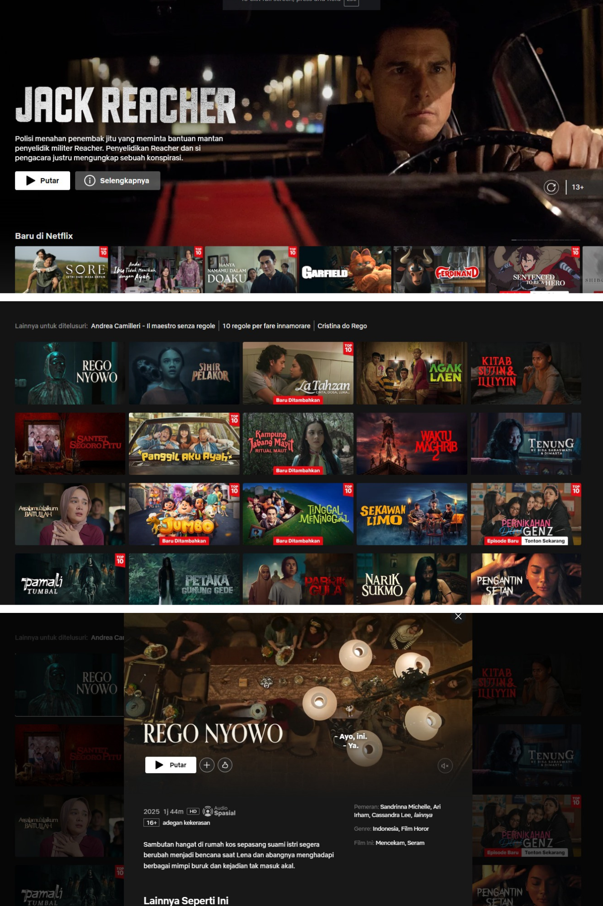
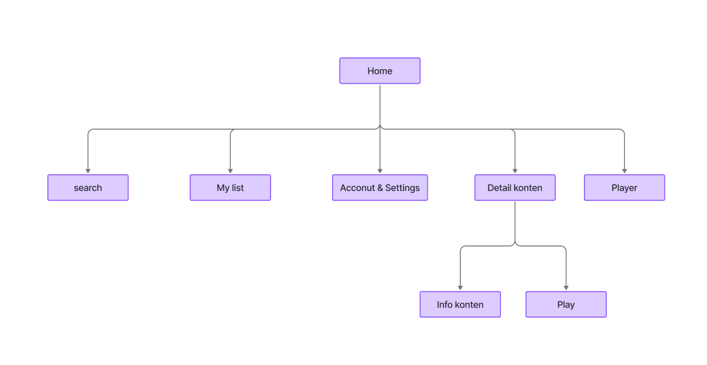
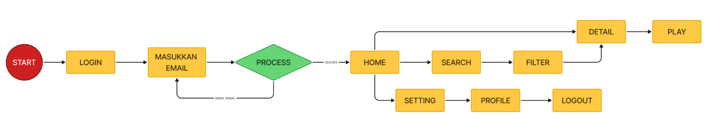
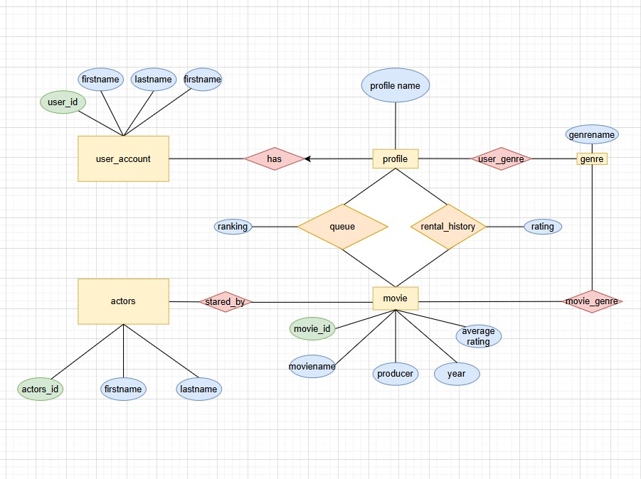

# Deconstruct: Netflix.com

**Versi:** 1.0 • **Tanggal:** 2026-01-09
---

## 1. Ringkasan 
Netflix adalah platform streaming berbasis subscription yang nyediain film, series, dokumenter, dan konten original. Fokus utamanya: personalized entertainment—semakin sering dipakai, makin “ngerti kamu”. UX-nya dibuat super simpel biar user tinggal duduk, klik, nonton.

---

## 2. Tujuan Analisis
- Memahami alur pengalaman pengguna (onboarding → discovery → watching → post-watch).
- Mengidentifikasi fitur inti dan pola desain Netflix.
- Memberikan insight & rekomendasi untuk membangun produk streaming serupa.

---

## 3. Target Pengguna & Persona
- Penonton casual: nonton santai, pilih konten populer, jarang eksplor.
- Binge-watcher: nonton berjam-jam, lanjut episode otomatis.
- Content explorer: suka cari genre unik, film hidden gem.
- Kids profile: anak-anak dengan kontrol konten khusus.
- Admin/Operator: kelola konten, algoritma, dan performa platform.

## 4. Fitur Inti & Prioritas Produk
- Onboarding: pilih paket, preferensi genre, buat profil.
- Discovery: rekomendasi personal, trending, kategori genre.
- Search: pencarian judul, aktor, genre.
- Playback: auto-play, skip intro, resume watching.
- Profile system: multi-profile, kids mode.
- Download offline: nonton tanpa internet.
- Account & billing: manajemen langganan, pembayaran.
---

## 5. UI/UX Patterns
Halaman awal, search

---
## 6. Site Map  
Berikut Daftar Halaman.

---

## 7. User Flow Diagrams  
Berikut diagram alur utama (buyer, seller, admin, search/checkout).

---
## 8. ERD  
Berikut ERD .

---

## 9. Monetisasi & Model Bisnis 
- Komisi dari penjualan (seller fees)
- Iklan & promoted listings
- Layanan premium seller (analytics, logistics, financing)
- Transaksi value-adds (escrow, insurance)
---

## 10. Competitive Advantages & Risks 
- Keunggulan: brand trust, ekosistem layanan (logistics + payment + merchant tools), skala pengguna
- Risiko: regulasi marketplace, persaingan (Shopee, Bukalapak), cost of promotions & subsidies
---
